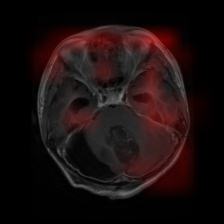

# 🧠 Brain MRI Tumor Classifier

Deep learning project for **automatic brain tumor classification from MRI scans** using PyTorch.  
The model is trained to distinguish between four categories:  
- **Glioma**  
- **Meningioma**  
- **Pituitary tumor**  
- **No tumor**

---

## 📂 Project Structure
- `data_loader.py` – custom PyTorch `Dataset` & `DataLoader` for train/val/test splits  ( Note: The dataset is from Kaggle: https://www.kaggle.com/datasets/masoudnickparvar/brain-tumor-mri-dataset)
- `model.py` – CNN architecture (5 convolutional blocks + fully connected head)  
- `train.py` – training loop with checkpointing, LR scheduler, and performance plots  
- `test.py` – final evaluation, confusion matrix, classification report, and Grad-CAM visualizations  
- `external_eval.py` – evaluation on external BRISC dataset for generalization testing  

---

## 📊 Results

### Internal Test (Nickparvar dataset, clean split)
- **Accuracy:** 98.0%  
- Balanced performance across all four classes  
          Classification report:
              precision    recall  f1-score   support

      glioma       1.00      0.97      0.98       300
  meningioma       0.96      0.95      0.96       306
     notumor       0.97      1.00      0.99       405
   pituitary       0.99      1.00      0.99       300

    accuracy                           0.98      1311
   macro avg       0.98      0.98      0.98      1311
weighted avg       0.98      0.98      0.98      1311

### External Test (BRISC 2025 dataset)
- **Accuracy:** 93.7%  
- Demonstrates strong generalization to unseen MRI data from different scanners  

---

## 📈 Performance Visualization
| Training Loss & Validation Accuracy | Confusion Matrix | Grad-CAM |
|-------------------------------------|------------------|----------|
|  |  |  |

---

## ⚙️ Technical Details
- **Framework:** PyTorch  
- **Input size:** 224×224 RGB MRI scans  
- **Architecture:**  
  - 5× Conv2D + BatchNorm + ReLU + MaxPool  
  - Fully connected classifier with dropout  
- **Training setup:**  
  - Optimizer: Adam (lr=0.001)  
  - Scheduler: ReduceLROnPlateau  
  - Loss: CrossEntropyLoss  
  - Epochs: 35  

---

## 📌 Key Features
- Clean train/val/test splits (no data leakage)  
- Explainability with **Grad-CAM** heatmaps  
- External validation for robust evaluation  
- Automatic saving of best model checkpoint  

---

## 🚀 Future Work
- Experiment with transfer learning (ResNet/EfficientNet)  
- Deploy as an inference API for real-time MRI classification  
- Explore 3D MRI volumes instead of 2D slices  
